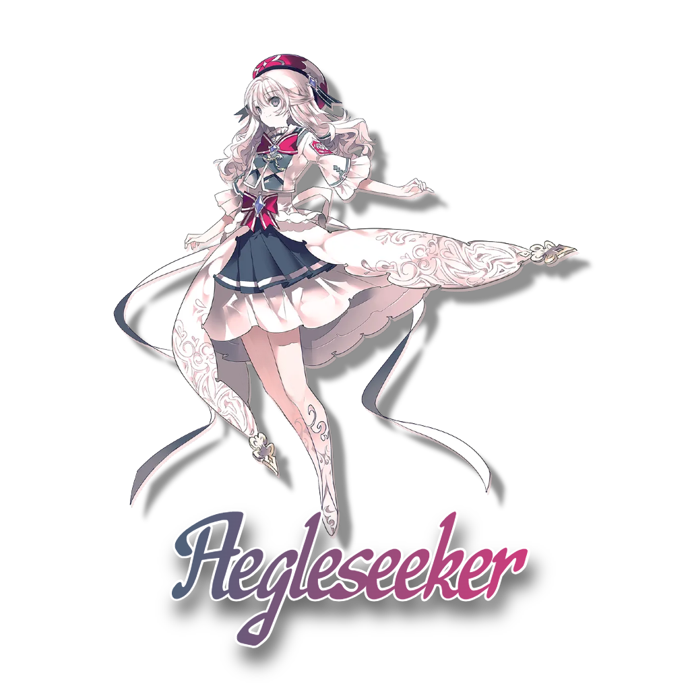

<div align="center">



# Azyre Client

**A next-generation Minecraft utility client powered by DirectX 11 and Dear ImGui**

[](https://en.cppreference.com/w/cpp/20)
[](https://learn.microsoft.com/en-us/windows/win32/direct3d11/dx-graphics-overviews)
[](https://www.microsoft.com/windows)
[](https://cmake.org/)
[](LICENSE)
[](https://github.com/AnarchDevelopment/aegledll/releases)

<br/>

> Built by [**an4rch Development**](https://github.com/AnarchDevelopment) — precision-engineered for performance and extensibility.

</div>

---

## ✨ Overview

**Azyre** is a high-performance C++20 DLL client that hooks into Minecraft's rendering pipeline via DirectX 11. It provides a comprehensive suite of modules — from combat assists to visual overlays — wrapped in a sleek, GPU-accelerated ImGui interface.

| Layer | Technology |
|---|---|
| Language | C++20 (MSVC / CMake) |
| Rendering | DirectX 11 + HLSL shaders |
| GUI | Dear ImGui with custom DX11 backend |
| Hooking | MinHook (x64) |
| Config | nlohmann/json |
| Audio | miniaudio |
| Images | stb_image / stb_image_write |
| Networking | Winsock2 / IRC client |

---

## 🗂️ Project Structure

```
Azyre/
├── Animations/          # Easing & animation system
├── ArrayList/           # HUD active-module list
├── Assets/              # Fonts, textures, shaders, audio, RC resources
│   ├── Fonts/
│   ├── CategoryImage/
│   ├── MarketAssets/
│   ├── stb/
│   ├── blur_ps.hlsl     # Blur pixel shader
│   └── blur_vs.hlsl     # Blur vertex shader
├── Config/              # JSON config serialization / deserialization
├── Core/                # DX11 Present hook & main thread
├── GUI/                 # ImGui window orchestration & DX11 renderer
├── Hook/                # WndProc / D3D hook management
├── ImGui/               # Dear ImGui source + markdown extension
├── Input/               # Keyboard/mouse input & UWP compatibility
├── MinHook/             # Inline function hooking library
├── Modules/             # All feature modules (see below)
│   ├── Combat/
│   ├── Movement/
│   ├── Visuals/
│   ├── Misc/
│   ├── Info/
│   ├── Terminal/
│   ├── Splash/
│   ├── PatternScan/
│   └── Alloc/
├── Networking/          # IRC client & chat overlay
├── Utils/               # HUD element base, WinRT title helper
├── miniaudio/           # Single-header audio library
├── nlohmann/            # Single-header JSON library
└── dllmain.cpp          # DLL entry point
```

---

## 🧩 Module System

Each module lives in its own directory with a `.hpp`/`.cpp` pair and registers itself through the `ModuleManager`.

### ⚔️ Combat
| Module | Description |
|---|---|
| **Hitbox** | Expands entity hitboxes for easier targeting |
| **Reach** | Extends melee attack range |

### 🏃 Movement
| Module | Description |
|---|---|
| **AutoSprint** | Automatically maintains sprint state |
| **Fly** | Free-flight movement override |
| **Glide** | Reduces fall speed for smooth descent |
| **Timer** | Adjusts game tick speed |

### 👁️ Visuals
| Module | Description |
|---|---|
| **ClickGUI** | Full-featured category-based settings panel |
| **ArrayList** | HUD list of active modules |
| **CPSCounter** | Real-time clicks-per-second overlay |
| **FPSOverlay** | Framerate display |
| **FullBright** | Maximum ambient lighting |
| **Keystrokes** | Animated key-press display |
| **MotionBlur** | Post-process motion blur via HLSL |
| **PingCounter** | Live network latency overlay |
| **PlayerInfo** | Nearby player information display |
| **RenderInfo** | GPU/render statistics overlay |
| **Watermark** | Customizable client branding |

### 🔧 Misc
| Module | Description |
|---|---|
| **AntiAFK** | Prevents AFK kick |
| **AutoClicker** | Configurable automatic clicking |
| **Screenshot** | In-game screenshot capture |
| **UnlockFPS** | Removes frame rate cap via DXGI |

### 💬 Networking
| Module | Description |
|---|---|
| **IRC Client** | Built-in IRC chat with overlay panel |

---

## 🔨 Building

### Prerequisites

- Windows 10 / 11
- [Visual Studio 2022+](https://visualstudio.microsoft.com/) with **Desktop development with C++**
- [CMake 3.20+](https://cmake.org/download/)
- Windows SDK 10.0+

### Build with CMake

```bash
# Clone
git clone https://github.com/AnarchDevelopment/aegledll.git
cd aegledll

# Configure (x64 Release)
cmake -B build -A x64

# Build
cmake --build build --config Release
```

Output: `build/Release/Azyre.dll`

### Build with Visual Studio

1. Open `build/Azyre.slnx` in Visual Studio
2. Select **Release | x64**
3. Build → Build Solution (`Ctrl+Shift+B`)

---

## ⚙️ Configuration

Configs are stored as JSON files and managed by `Config/ConfigManager`:

```json
{
  "modules": {
    "Watermark": { "enabled": true },
    "MotionBlur": { "enabled": false, "intensity": 0.5 }
  }
}
```

---

## 📦 Dependencies

All dependencies are **vendored** — no package manager needed.

| Library | Version | Purpose |
|---|---|---|
| [Dear ImGui](https://github.com/ocornut/imgui) | Custom | GUI framework |
| [MinHook](https://github.com/TsudaKageyu/minhook) | Bundled | x86/x64 hooking |
| [nlohmann/json](https://github.com/nlohmann/json) | Bundled | JSON config |
| [stb_image](https://github.com/nothings/stb) | Bundled | Image loading |
| [miniaudio](https://miniaud.io/) | Bundled | Audio playback |
| [imgui-markdown](https://github.com/juliettef/imgui_markdown) | Bundled | Markdown in ImGui |

---

## 📄 License

This project is licensed under the **an4rch Development Public Source License 1.0**.  
See [LICENSE](LICENSE) for full terms.

---

## 👤 Contact

<div align="center">

| Platform | Handle |
|---|---|
| GitHub | [@iVyz3r](https://github.com/iVyz3r) |
| Discord | `nqtvyzer` |
| Organization | [an4rch Development](https://anarchdevelopment.github.io/) |

</div>
